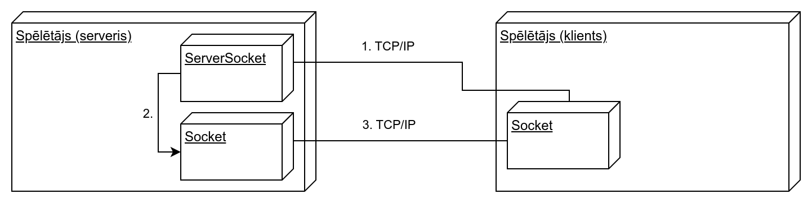
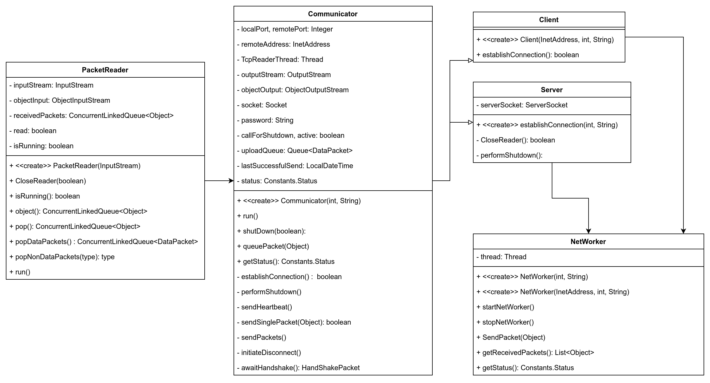

# CO-OP spēle

## Ievads

Projekts tika veidots kursa OOP ietvaros. Projekta laikā tika izveidota 2 spēlētāju CO-OP 
spēle. Pašlaik implementētas ir klases, lai viegli pievienotu jaunus pretiniekus, cīņas
elementi un spēlētāju kustību un mijiedarbība ar apkārtējo vidi.

### Motivācija

Mēs izvēlējāmies taisīt spēli kā mūsu projektu, jo atšķirībā no citiem Javas pielietojumiem, šis
viennozīmigi rada interesi. Neviens no mums nekad nav strādājis pie spēles izstrādes. Mūsu 
repertuārā ir mājaslapu izveide, komandrindu labirinti un līdzīga mēroga projekti.
Ar šo projektu mēs vēlamies izaicināt sevi un iepazīt spēļu dizainu, lai atrastu pielietojumu
pašreizējamajām programmēšanas prasmēm.

___

## Projekta struktūra un resursi

Projekts ir realizēts izmantojot java 20 un kompilēts izmantojot maven.

Izmantotās resursu pakas spēles realizācijā:

* https://brullov.itch.io/oak-woods
* https://sventhole.itch.io/bandits

### Tīkla pārskats

1) ServerSocket uz servera spēlētāja saslēgumu no otra spēlētāja
2) Atrodot otru spēlētāju atrodot, ServerSocket nodod sesiju uz socket
3) Socket pārbauda 2. spēlētāja sūtīto paroli, un ja tā ir pareiza, turpina sarunu

1) PacketReader ir klase, kas ir paredzēta ienākošo pakešu nolasei
2) Communicator ir abstrakta klase, kas izbūvē svarīgāko komunikācijai
3) Client un Server klases papildina Communicator klasi, lai implementētu izkrītošo funkcionalitāti, kas ir nepieciešama sarunai starp serveri un klientu
4) Networker apvieno klienta un servera funkcionalitāti paslēpjot šīs atšķirības no tālāka koda. Visas metodes starp servera un klienta darbību ir vienādas, izņemot tas, kā klase tiek inicializēta. Ja klase tiek inicializēta nododot portu un paroli, tad šī klase kļūst par serveri, bet ja tiek arī padota adrese, tad šī klase uzņem klienta lomu.

___

## Uzstādīšana

### Spēles uzstādīšana

#### Bez kompilēšanas

*Pašlaik neaktuāli*

~~Ja vēlas spēli palaist bez nepieciešamības kompilēt, tad ir iespējams nolādēt nokompilēto versiju no `Releases` sadaļas..~~

#### Ar kompilēšanu

Ja vēlaties kompilēt spēli, ir nepieciešams openjdk 20.
Pēc tam spēli var atvērt caur Eclipse vai IntelliJ, palaižot iekš rīka vai to eksportējot.

### Savienošanās, lai spēlētu kopā

**Svarīgi:** Pašlaik vienīgais veids, kā norādīt paroli, servera portu un adresi ir tos nomainīt zem pakotnes 'Networking' klasē 'Constants'.
Nākamajā versijā ir paredzēts šos parametrus ievadīt caur UI.

Lai izveidotu CO-OP bāzi, jeb mūsu gadījumā divu spēlētāju spēli, vienam no spēlētājiem būs
jābūt serverim, bet otram klientam. Klients pieslēdzas pie servera un pārsūta savus datus, kuri tiek pārstrādāti
un attiecīgi attēloti iekš spēles loga.

Spēlētājam, kurš ir serveris ir jāuzsāk spēle ar `Host` pogu, kur būs jāievada ports pie kura slēgsies otrs spēlētājs.
Ir svarīgi atcerēties, ka otrajam spēlētājam ir jābūt piekļuvei pie servera spēlētāja porta.
Vislabākā metode ir spēlēt, kad abi spēlētāji ir LAN, taču, ja nav citas iespējas, servera spēlētājs var mēģināt atvērt savu servera portu.
Servera spēlētājam arī būs jāizvēlās parole, ko otrs spēlētājs izmantos, lai pieslēgtos pie pirmā spēlētāja.

Klienta spēlētājam, tad kad servera spēlētājs ir uzsācis spēli ir jāpievienojas izmantojot `Join` pogu.
Klienta spēlētājam būs jāievada servera spēlētāja adrese, ports un parole, lai varētu pieslēgties spēlei.
